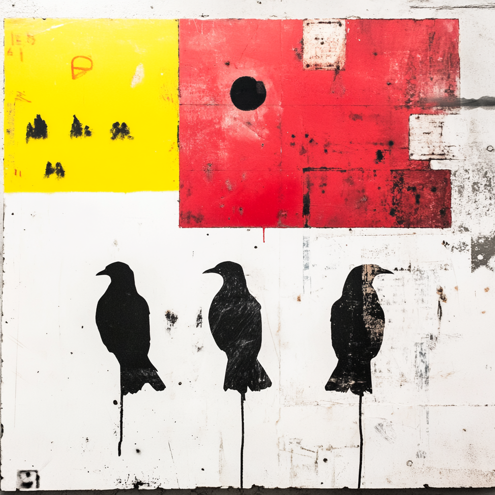

## The Tale of the Three Names

One winter, the researchers returned to Mira with a new challenge.

"This time," they said, "there are not two doors — there are many.
A penguin may be Adelie, or Gentoo, or Chinstrap.
Which name belongs to which bird?"

Mira smiled.

"This is still supervised learning," she said.
"But now the model must choose from **several possible classes**.
This is **multiclass classification**."

So the villagers gathered many examples:

Flipper lengths.
Wing shapes.
Measurements and labels —
each bird already known by name.

As always, Mira **held some back**
so the model could be tested honestly later.

### Teaching the model to weigh every possibility

Mira trained the model to return **probabilities**, not certainty.

For each bird, the model whispered something like:

"20% this
30% that
50% the other."

Sometimes, the model learned three separate inner voices —
each one asking:

"Is it this class… or everything else?"

Other times, a single voice spoke for all three at once —
sharing out belief across the names.

But in the end, the rule was simple:

> **Choose the class with the highest probability.**

Not because it is always right —
but because it is **most likely**.

### Testing what has been learned

When the model was trained,
Mira brought out the penguins she had kept aside.

For each one, the model guessed the name.
Then Mira compared **ŷ** — what the model predicted —
with **y** — the truth already known.

### The square of many truths

She built a larger **confusion matrix** —
a grid where every row was a truth
and every column was a guess.

Along the diagonal, prediction and reality matched.
Off the diagonal, the model stumbled.

From this, Mira measured:

* **Accuracy** — how often the model was right overall
* **Recall for each class** — how often each true class was correctly found
* **Precision for each class** — how trustworthy each prediction was
* **F1-scores** — the balance between recall and precision

And finally, she combined the numbers
to understand the model as a whole.

None of this was magic.
It was care.

### And as always — refinement

Mira returned to the long rhythm of her craft:

train
validate
measure
refine

until the model's mistakes
grew gentle enough to live beside.

---

## The moral

When there is more than one name a thing may carry,
a wise model does not shout an answer —
it **weighs possibilities**
and speaks the most likely truth.

Wisdom is not in guessing —
but in **measuring how wrong you might be**,
and learning from it.

---

For more detail, see the official Microsoft Learn lesson:
[Multiclass Classification](https://learn.microsoft.com/en-us/training/modules/fundamentals-machine-learning/6-multiclass-classification)
