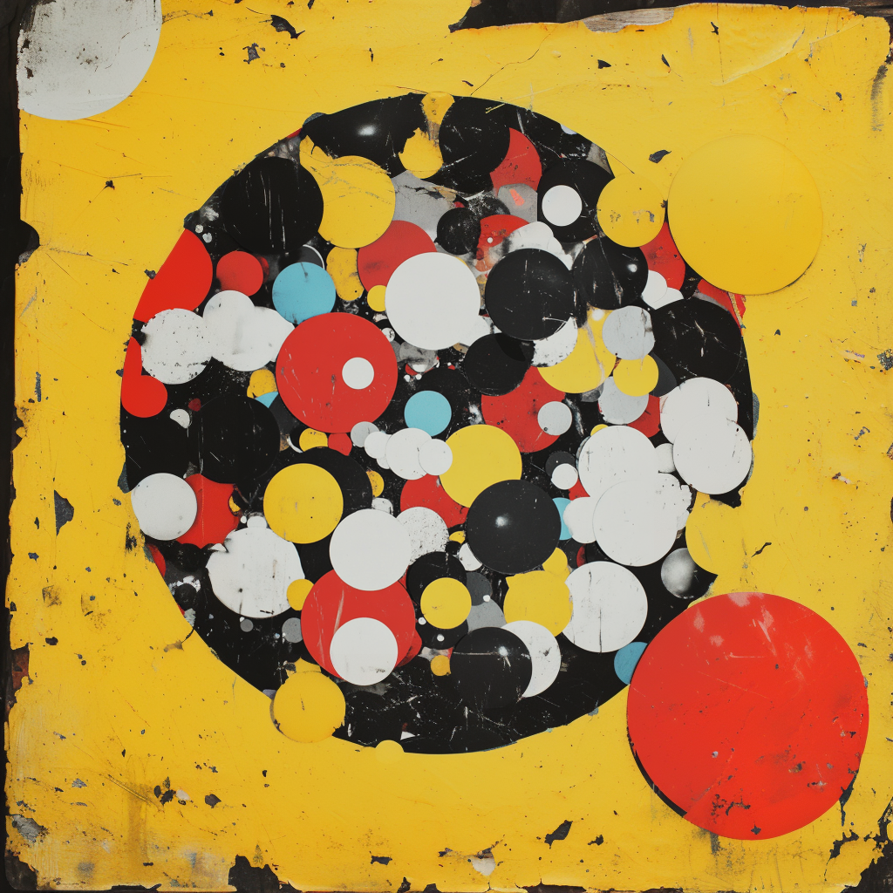

## The Story of Hidden Circles

One spring morning, the villagers came to Mira again.
This time, they had no answers — only **questions without labels**.

"We have many observations," they said, "but we do not know where they belong.
Can you help us see how they group?"

Mira nodded.

"This time, we will not teach the model with answers," she said.
"We will let it reveal patterns that were already there."

This was **unsupervised learning**, and the task was called **clustering**.

### The field of unlabeled things

The villagers brought flowers of all kinds —
different sizes, shapes, numbers of leaves and petals.
They brought customers of many habits —
some who visited often, some who seldom came.

No labels.
No pre-assigned classes.
Only features — the measurable truths of each observation.

Mira set these before her machine.

### Letting similarity speak

Instead of teaching the machine to match known answers,
Mira asked it to **notice similarity**.

The machine looked at the patterns of features,
gently grouping what belonged together:

* flowers that looked alike
* customers who behaved alike

No names were given.
The machine simply whispered:

"Group these with these…
and those with those."

What emerged were **clusters** — groups of similar stories.

### Naming what was found

When the machine had finished,
villagers examined the clusters:

"Here are the bright petals," they said.
"There are the frequent customers," they said.

So they named them —
and sometimes used those names later,
when they needed to build models that **did** have labels.

Clustering had revealed the *shape of the world* without ever being told what the world should be.

### Seeing clarity in emergence

Mira showed them how clustering is like seeing circles in the fog:

You do not tell the fog what to reveal.
You simply watch until the shapes become clear.

And when they did, people could do more than sort —
they could **understand**.

---

## The moral

Not all learning begins with answers.

Sometimes, the world's patterns exist before we name them.
Clustering is the art of letting similarity find its own company, and then **letting those discoveries guide the next step**.

---

For more detail, see the official Microsoft Learn lesson:
[Clustering](https://learn.microsoft.com/en-us/training/modules/fundamentals-machine-learning/7-clustering)
