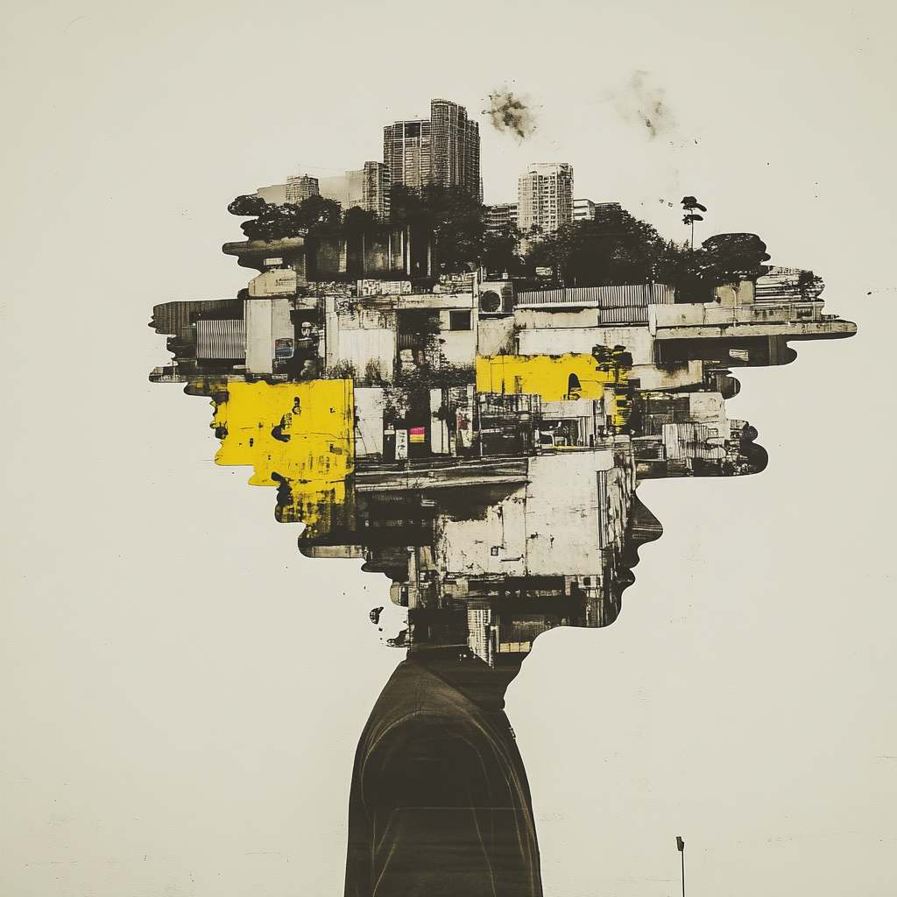

## The Garden of Many Layers

After many seasons of teaching machines to learn from examples, the villagers came again with a new curiosity.

"We have patterns too subtle," they said, "for ordinary eyes and ordinary rules."

Mira listened, and then she walked them to the **Garden of Many Layers** — a place where simple paths branched into hidden trails, and complexity grew in quiet abundance.

Traditional models — like straight lines and decision borders — were good at shallow truths.
But some gardens had **depth**: the gentle curve of a flower's petal, the whispered shape of a human face, the murmur of sound changing over time.

To explore these, Mira spoke of **deep learning**.

### What grows beneath the surface

"Imagine a path," she said, "that wanders through many gates."

Each gate watches for a different kind of pattern:

* One gate notices edges and corners.
* Another sees combinations of those.
* Still deeper gates see shapes and forms and meanings.

These gates are called **layers** — and together, they form a **neural network**, a cascade of many small learners building on each other.

The first gates see simple truths.
Later gates see more complex ones.
And as information travels through the garden of layers, the network learns to recognize **what matters most**.

### Learning through adjustment

But how do the gates know what to look for?

Mira explained that deep learning models **learn by adjusting themselves**.

They make a guess.
They measure how far they are from the truth.
They gently change the strengths of their connections.
They guess again.

This process is called **backpropagation** — a conversation between layers, where each gate learns from the part it plays in the whole.

### Many stories, one understanding

Deep learning can learn from:

* pictures
* speech
* text
* sequences of time
* and many patterns too rich for simpler models

These networks become powerful because they learn **representations within representations** — patterns inside patterns — like a forest that knows both leaf and tree.

### Of complexity and intuition

But Mira cautioned:

"Greater power comes with greater care.
These gardens are beautiful, but they are deep.
They require more stories.
More patience.
And more wisdom."

---

## The moral

When the world's patterns are rich and layered,
simple lines and curves cannot trace them all.

Deep learning is not a single rule —
but a **garden of many layers**,
each learning to see a facet of truth.

In the end, the greatest wisdom in any model is knowing **how deeply to look**,
and when to trust what you see.

---

For more detail, see the official Microsoft Learn lesson:
[Deep Learning](https://learn.microsoft.com/en-us/training/modules/fundamentals-machine-learning/8-deep-learning)
